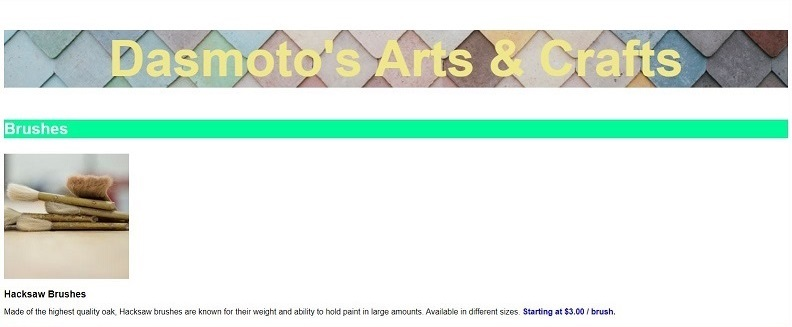

# Dasmotos Arts and Crafts

This project was completed as part of Codecademy's Build a Website with HTML, CSS, and Github Pages Path. As part of the Intro to Local Website Development tutorial we used our own text editor to practice our HTML and CSS skills with an off-platform website project. Using the provided design spec and images, we were required to build this simple website for a fictional arts and crafts store, utilizing a folder structure that made sense for the project.

## Table of Contents

- [Technologies](#technologies)
- [Screenshots](#screenshots)
- [Status](#status)

## Technologies

This project was created with:

- HTML5
- CSS3

## Screenshots

## Status

This project has been completed.
